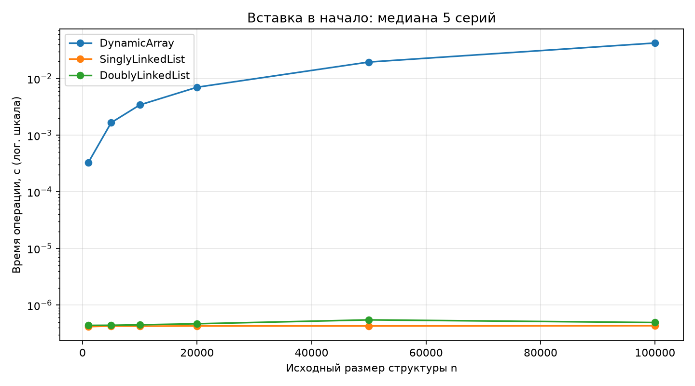
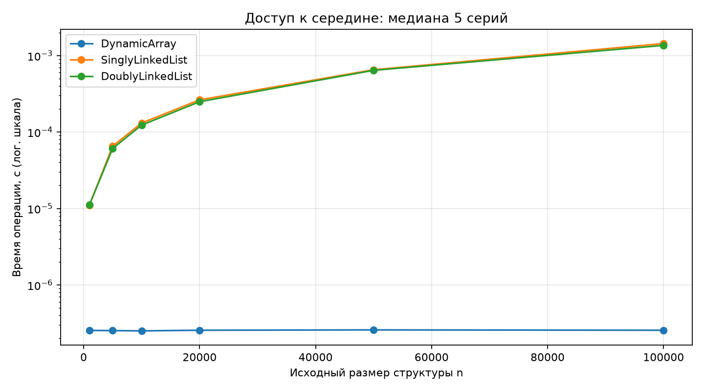

# Отчёт по лабораторной работе №2

## Цель и реализация

Реализованы односвязный список без tail и двусвязный список с head и tail. Узлы содержат значение и ссылки. При удалении первого или последнего узла корректируются границы списка; удаляется первое совпадение. Разворот двусвязного списка переставляет ссылки каждого узла и меняет head с tail, сохраняя сами узлы.

В односвязный список добавлен get(index), необходимый для золотого эксперимента. В двусвязном get проход начинается от ближайшего конца. Массив перенесён из ЛР1, поэтому репозиторий запускается независимо.

## Методика измерений

Измеряются операции на заранее заполненной структуре размера n, а не время её построения. Во всех структурах перед замером одинаковая последовательность 0, 1, …, n−1. Подготовка, сборка мусора перед серией и проверки корректности находятся вне таймера. Сборщик мусора во время замера включён.

Для prepend выполняется серия из 50 вставок: размер меняется от n до n+50. Для get(n//2) выполняется 200 обращений к одной позиции. Время серии делится на количество операций, затем берётся медиана 5 повторов. CSV содержит исходные времена серий и нормированные значения. Использован time.perf_counter(); сведения о среде сохранены в results/environment.txt.

Такой эксперимент оценивает стоимость одной операции при размере около n. Он отличается от заполнения пустой структуры n вставками: полная серия prepend занимает O(n) у списка и O(n²) у массива. Подготовка большого односвязного списка через prepend занимает O(n), вместо O(n²) при append без tail.

## Результаты

Медиана времени одной операции, микросекунды:

| n | Операция | DynamicArray | SinglyLinkedList | DoublyLinkedList |
|---:|---|---:|---:|---:|
| 1000 | prepend | 327.446 | 0.416 | 0.438 |
| 1000 | get_middle | 0.254 | 11.076 | 11.141 |
| 5000 | prepend | 1661.522 | 0.426 | 0.440 |
| 5000 | get_middle | 0.253 | 65.231 | 60.817 |
| 10000 | prepend | 3415.588 | 0.424 | 0.448 |
| 10000 | get_middle | 0.251 | 131.106 | 123.221 |
| 20000 | prepend | 7014.236 | 0.428 | 0.468 |
| 20000 | get_middle | 0.255 | 263.161 | 249.103 |
| 50000 | prepend | 19527.652 | 0.428 | 0.548 |
| 50000 | get_middle | 0.258 | 652.058 | 640.933 |
| 100000 | prepend | 42333.628 | 0.432 | 0.492 |
| 100000 | get_middle | 0.255 | 1435.409 | 1359.001 |

На вертикальных осях логарифмическая шкала. Замеры зависят от интерпретатора, оборудования и фоновой нагрузки. Небольшие различия между списками не меняют асимптотическую сложность. Графики показывают время одной операции, не суммарное время n операций.

## Сравнительная таблица

| Операция | DynamicArray | Односвязный без tail | Двусвязный с tail |
|---|---|---|---|
| Доступ по индексу | O(1) | O(n) | O(n), от ближайшего конца |
| Вставка в начало | O(n) | O(1) | O(1) |
| Вставка в конец | O(1) амортизированно | O(n) | O(1) |
| Удаление произвольного элемента после его обнаружения | O(n), сдвиг | O(n) для поиска предыдущего; O(1), если он известен | O(1), перестановка ссылок |
| Удаление по значению | O(n), поиск и сдвиг; в API remove принимает индекс | O(n) | O(n) |
| Поиск по значению | O(n) | O(n) | O(n) |
| Разворот | Не реализован | Не реализован | O(n), дополнительная память O(1) |
| Память, схема без накладных расходов Python | capacity ссылок на данные | n × (данные + next) | n × (данные + prev + next) |

У массива резерв capacity может превышать n. В ctypes хранятся ссылки на объекты, а не сами произвольные Python-объекты. Реальные узлы Python имеют дополнительные накладные расходы, поэтому таблица памяти — схема, а не замер байтов. Для односвязного списка с tail вставка в конец могла бы стать O(1), но по бронзовому заданию tail не используется. Публичный delete(data) двусвязного списка имеет O(n), поскольку сначала ищет значение; отдельного публичного delete_node в задании нет.

## Проверка

Пройдены 11 тестовых методов: 5 для списков и 6 для перенесённых массивов. Проверены примеры раздатки, пустой список, единственный элемент, дубликаты, удаление головы и хвоста, отсутствие значения, индексы, двойной разворот и сохранение узлов. В 3000 случайных операциях со списками после каждого изменения проверяются размер, порядок и обе стороны связей. Ограниченные проходы обнаруживают циклы без зависания тестов.

## Выводы

Вставка в начало списка меняет постоянное число ссылок, а массив сдвигает существующие элементы. Для доступа к середине массив сразу обращается к ячейке, а список проходит по ссылкам. Эксперимент иллюстрирует выбор структуры под операции: списки подходят для частых вставок в начало, массив удобнее для произвольного доступа. Двусвязность даёт обратный проход и простое отсоединение известного узла ценой дополнительной ссылки.
